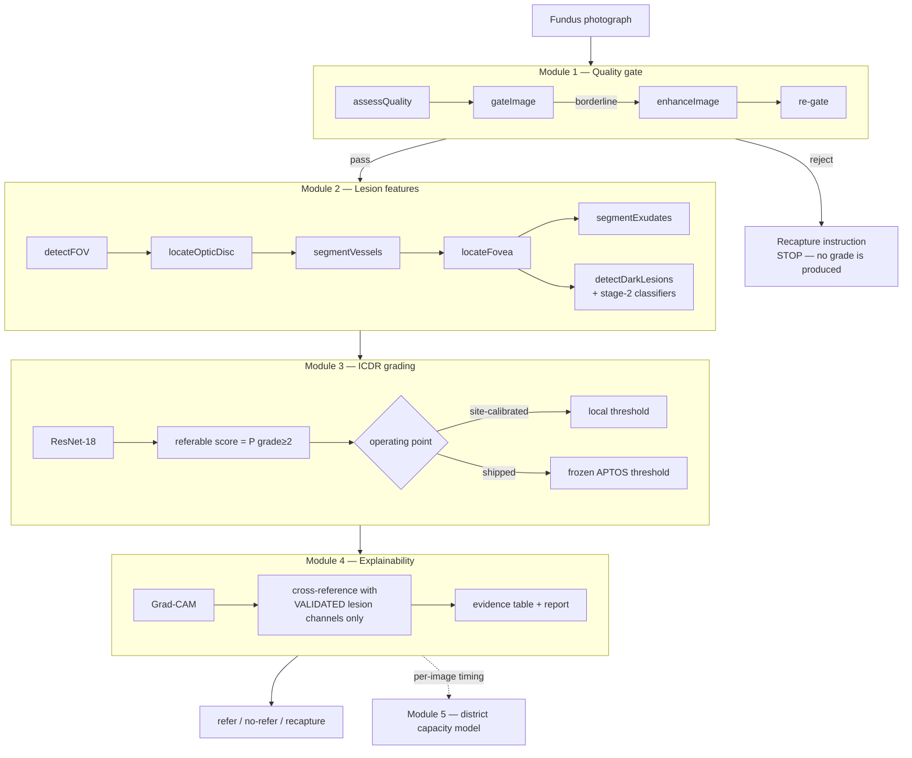
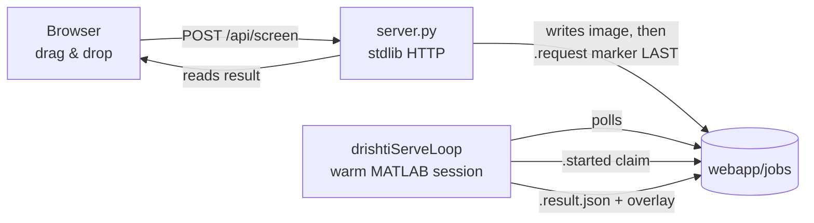

# Architecture

How DRishti-AI is put together, and — more importantly — *why* it is put together
this way. The unusual decisions here are almost all about one thing: making it
structurally hard for the system to tell a clinician something it cannot support.

---

## 1. The pipeline



**A rejected image stops at Module 1.** It never reaches the grader. Most
published pipelines grade everything and report accuracy only on the images that
happened to be gradable; this one returns a retake instruction instead, because an
ungradable photograph must not become a confident diagnosis.

---

## 2. Entry points

| Entry point | What it is | Use when |
|---|---|---|
| `runDrishtiPipeline(img)` | One image, all modules | Programmatic single-image |
| `runDrishtiSystem(folder)` | Cohort + district capacity | Batch, Module 5 sizing |
| `drishtiDashboard` | MATLAB `uifigure` app | Local GUI, no server |
| `webapp/server.py` | Browser dashboard | Drag-and-drop, demos |
| `run_demo` | Scripted demo with caveats | Judges, walkthroughs |

### The browser dashboard is two processes



**Why a file queue and not a socket.** MATLAB has no stdlib HTTP server, and
piping to a `-nodesktop` process deadlocks miserably on Windows. A job folder is
inspectable with `dir` and survives either half restarting.

**Why a warm worker and not `matlab -batch` per request.** Measured on the dev
machine: ~39 s cold vs ~8 s warm, almost all of it one-off GPU/cuDNN init.

**The write ordering is the protocol.** Server writes the image *first* and the
`.request` marker *last*, so the worker can never pick up a half-written image.
The worker writes a `.started` claim *before* inference, so the server can tell
"busy" from "dead" — MATLAB is single-threaded and cannot heartbeat mid-inference.

---

## 3. Contracts — the files that own decisions

Nothing clinical is decided in application code. Each of these owns one decision,
and code reads from it.

| File | Owns | Frozen? |
|---|---|---|
| `config/drishti_paths.m` | every dataset path | — |
| `config/dataset_layout.json` | expected layout (shared by Python + MATLAB tests) | — |
| `config/quality_thresholds.json` | Module 1 gate cut-offs (measured, not guessed) | — |
| `config/clinical_definitions.json` | referable-DR endpoint, DME encoding per dataset | ✅ |
| `config/lesion_validation_thresholds.json` | lesion reporting bar | ✅ hashed |
| `config/exudate_split.json` | hard/soft exudate boundary (fitted on train) | — |
| `config/telemedicine_parameters.json` | Module 5 inputs, each tagged SOURCED/DERIVED/ASSUMED | — |

**Frozen means**: written down *before* the measurement that it judges. The lesion
bar goes further — its SHA-256 is recorded inside `results/lesion_validation.mat`,
and a test fails if the file changes without a re-run. A threshold chosen after
seeing the numbers is not a threshold; it is a description of the numbers.

---

## 4. The honesty gates

These are the load-bearing parts of the design. Each exists because the failure it
prevents is silent.

### 4a. Lesion display is measurement-gated, and fails closed

```
extractLesionFeatures
  └─ loadLesionReliability()        reads results/lesion_validation.mat
       └─ reliable = (precision ≥ 0.50) AND (recall ≥ 0.10)
            └─ no file on this machine  →  every channel reliable = false
```

These flags used to be four hardcoded booleans. That meant the report's honesty
depended on someone remembering to edit a source file after re-measuring. Now an
unmeasured detector and a failed one are treated identically: hidden.

A withheld channel renders as *"detector not validated"*, **never as zero**. Zero
is a clinical claim — "we looked and found none".

### 4b. The held-out set is protected in code

`assertNotHoldout` is called by `runDrishtiSystem`, `drishtiServeLoop`, the
dashboard's file picker, and `server.py` — because a holdout is destroyed
*silently*. There is no error and no failing test; a headline claim just quietly
stops being true. Messidor-2 was spent once, on 2026-09-12.

### 4c. The operating point travels with every number

Every result carries whether it came from the frozen APTOS threshold or a site
calibration, because the difference is 90.3% vs 31.2% sensitivity.

---

## 5. Design invariants

**All spatial quantities are in disc diameters, never pixels.** The corpora span a
6.7× resolution range; a pixel-denominated feature encodes the camera model, and
Module 3 would learn the dataset instead of the disease. The only pixel values
that survive to output are centroids for drawing markers.

**Grad-CAM is checked against evidence derived independently.** Module 2's
detectors never see the network's prediction, so a hotspot landing on a detected
lesion is genuine corroboration rather than circular reasoning. Measured
enrichment is 1.51× — above chance, *not* validated explainability.

**Ungradable ≠ healthy.** `fillUngradable` returns explicit NaNs, never zeros, so
Phase 3 cannot learn that unreadable images are normal.

---

## 6. Module 5 is not a per-image stage

Modules 1–4 run per image. Module 5 is a district-level queuing model. Integration
means feeding it the cohort's *measured* service time instead of an assumed
constant — the loop Phase 5 could not close on its own.

⚠️ SimEvents is licensed but **not installed**; the model uses a native
continuous-queue formulation. `ver()` and `license()` both report success for an
absent product, which is why `check_environment` reports `[NOT INST]` separately.

---

## See also

- [workflow.md](workflow.md) — how to run and re-measure everything
- [repository_map.md](repository_map.md) — what lives where
- [troubleshooting.md](troubleshooting.md) — the traps that cost real time
- [phase2_results.md](phase2_results.md) — lesion detector validation
- [clinical_definitions.md](clinical_definitions.md) — the referable-DR endpoint
