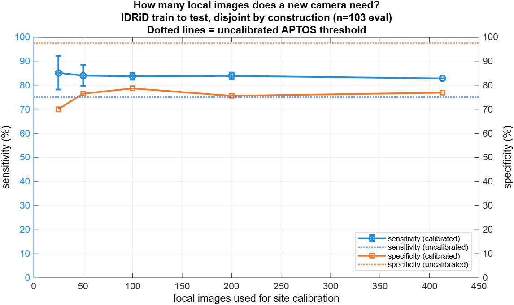
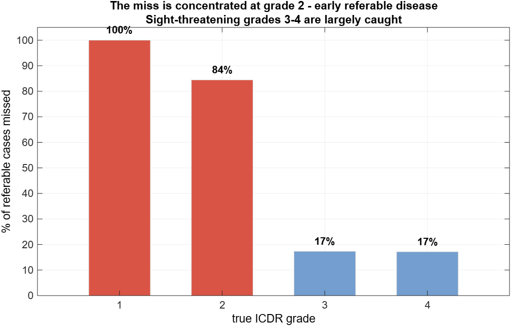
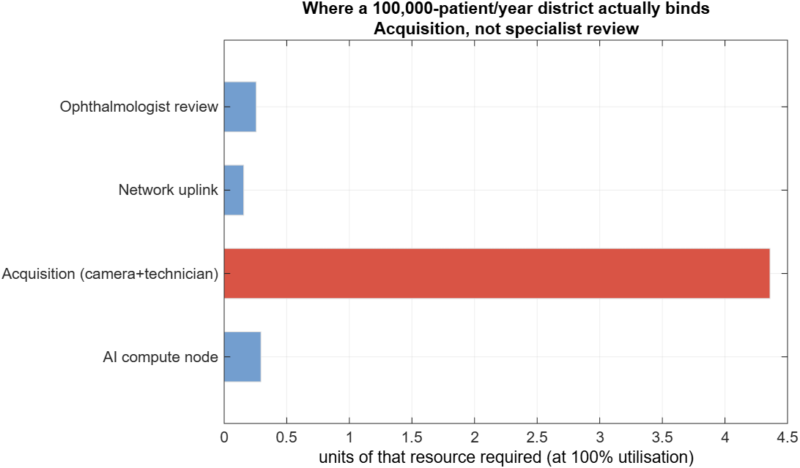
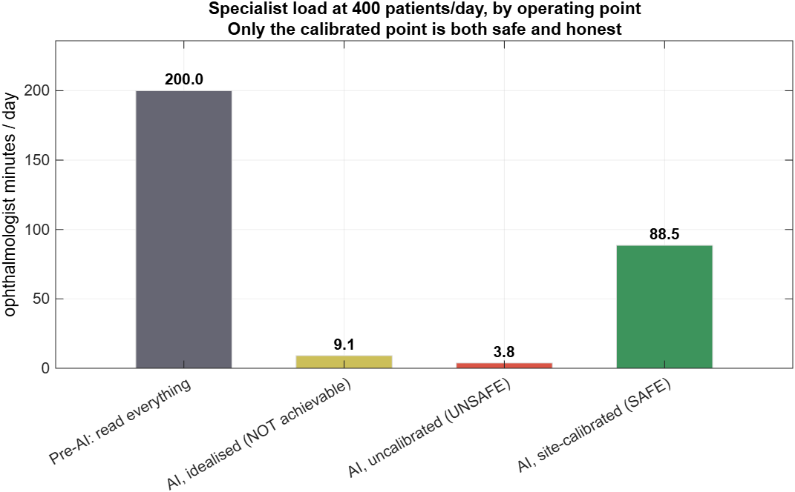

# DRishti-AI — pitch deck source

**SIH 2026 · SIH26038 · Team 111 "Neural Cyphers" · MathWorks track**

Slide-by-slide content for R5 (Oshi) to build from. Every number is measured and
traceable — the source document is named on each slide. Figures are in
`docs/figures/`, regenerated by `make_dashboard_figures()`.

> **Framing note for whoever presents this.** The strongest thing we have is not
> a headline accuracy number — it is that we *measured where the system fails and
> said so*. Several of our results are negative. A judge who finds a hidden
> weakness destroys the pitch; a judge who sees we found it first, quantified it,
> and designed around it does not. Lead with the rigour.

---

## Slide 1 — Problem

- India: ~15 ophthalmologists per million vs 38.6 in developed countries.
  District ratios range **1:6,309 (Hyderabad)** to **1:193,822 (Nalgonda)**.
- DR prevalence **12.5–13.7%** in screened populations (SMART India 2022;
  Dey et al. 2025, n=4,482).
- DR is **asymptomatic until late**. The bottleneck is *screening reach*, not
  treatment capacity.

*Source: `docs/literature_benchmarks.md`, `docs/telemedicine_parameters.md`*

---

## Slide 2 — Architecture

```
   fundus image
        │
   [1] Quality gate ──── ungradable ──→ retake instruction (technician)
        │ gradable
   [2] Lesion features (disc, fovea, vessels, exudates, dark lesions)
        │
   [3] ICDR grading (ResNet-18 @ 640px) ──→ calibrated referable probability
        │
   [4] Explainable report (Grad-CAM + evidence table, one page)
        │
   [5] Simulink district throughput model ──→ staffing / compute sizing
```

MATLAB/Simulink end-to-end. Single entry point: `runDrishtiSystem.m`.

---

## Slide 3 — What it produces

Show a live report (`demo/run_demo.m` → `reports/demo/*.html`):

- Fundus image with Grad-CAM overlay
- ICDR grade + calibrated confidence, **with the basis of that confidence stated**
- Evidence table linking attention to independently-detected lesions
- Recommended action and follow-up window
- Unreliable lesion channels render **"not validated"**, never a number

---

## Slide 4 — Accuracy, stated honestly

| | APTOS validation (in-domain) | Messidor-2 (held out, read once) |
|---|---|---|
| Sensitivity | **90.3%** | **31.2%** |
| Specificity | **95.9%** | 99.5% |
| AUC | 0.9891 | 0.8848 |

**Say this out loud:** the in-domain number is not the deployment number.
On unseen equipment the frozen threshold sits **4.1× above the median referable
case** — the model still *ranks* correctly (AUC 0.885), but the operating point
is wrong for that camera.

*Source: `docs/phase3_results.md` §3*

---

## Slide 5 — The fix, and its cost



Per-site calibration on ~200 local images recovers part of that gap. Measured
end to end on IDRiD (a different camera, held-back split): sensitivity
**75.0% → 82.8%**, specificity **97.4% → 76.9%**. ⚠️ The often-quoted
**31.2% → 90.0%** on Messidor-2 is a post-hoc demonstration on Messidor-2
itself, not an independent result — do not present it as achieved deployment
performance ([site_calibration.md](site_calibration.md) §4).

**It is mandatory, and it is not free:** calibration always buys sensitivity by
spending specificity, and it did **not** reach the 90% target out of sample.
More patients get flagged, so specialist load rises. We size staffing on the
*calibrated* operating point, never the uncalibrated one.

> **The chart above is the IDRiD replication, not the Messidor-2 headline.**
> Same procedure, a second camera: 75.0% → ~84% sensitivity, 97.4% → ~77%
> specificity. It is shown because Messidor-2 is spent and IDRiD can be split
> repeatedly, so the *shape* of the curve — flat from 25 images on, with the
> error bars collapsing — is what tells you ~200 images is the operating
> recommendation. Both experiments are tabulated in `phase3_results.md` §3b.

*Source: `docs/phase3_results.md` §3b*

---

## Slide 6 — Where the system fails



Not a uniform 31% miss — the failure is **concentrated at grade 2**:

- Grades 3–4 (sight-threatening): largely caught, ~17% missed
- **Grade 2 (early referable): 84% missed** — and grade 2 is **67% of all
  referable patients**

This is the clinically important distinction, and it tells us exactly what to fix.

*Source: `docs/phase6_results.md` §5.2*

---

## Slide 7 — Deployment model (Module 5)



Minimum viable district for **100,000 patients/year** (400/day):

| Resource | Minimum |
|---|---|
| Cameras + technicians | **6** |
| PHC uplinks | 1 |
| AI compute nodes | **1** (CPU — no GPU needed) |
| Ophthalmologists | 1 |

**Acquisition is the binding constraint**, not specialist review — confirmed by
analytic sizing *and* stochastic simulation independently.

*Source: `docs/phase5_results.md` §4*

---

## Slide 8 — What the AI is actually worth



| Review policy | Specialist load |
|---|---|
| Pre-AI: read every image | 200 min/day |
| AI triage, site-calibrated | **65.3 min/day** |

**~3.1× reduction.** We deliberately do *not* claim the ~6× that assuming a
perfect classifier would give — the specialist reviews what the model **flags**,
and at 76.9% specificity that is ~33% of all screens. The operating point is
IDRiD-measured (82.8% / 76.9%, held-back split); it misses ~17% of referable
patients and does not meet the >90% target.

**A PHC edge node needs no GPU:** measured on CPU — 7.6 s typical, **10.6 s mean**
(we size on the mean; 33% of images take 13-25 s). A GPU saves 0.2%.

*Source: `docs/phase5_results.md` §2, §5*

---

## Slide 9 — Engineering rigour (the differentiator)

Things we measured that most teams assume:

- **Messidor-2 touched exactly once.** Threshold frozen in a committed file
  beforehand; the entry point now **refuses** Messidor-2 paths in code.
- **"Integrated beats single-technique" — we tested it three ways and it does
  not hold.** The quality gate is a −9.2 pp specificity *regression*. We report
  that rather than claiming the opposite.
- **Unreliable detector outputs are suppressed, not displayed.** MA precision
  **0.028** on held-out data → the count never reaches the report. The gate was
  frozen *before* the measurement and is hash-checked by a test — the same gate
  file, unchanged, certified two independent measurements of that channel.
- **AI service time was measured**, not assumed — the code had 0.120 s; reality
  is 10.6 s mean / 7.6 s median (~88× off).
- Every parameter tagged SOURCED / DERIVED / MEASURED / ASSUMED.

---

## Slide 10 — Honest limitations

| Limitation | Status |
|---|---|
| External sensitivity without calibration | 31.2% — calibration is a precondition |
| Grade-2 detection | 84% missed — the main gap |
| Microaneurysm / haemorrhage / soft-exudate detectors | precision **0.028 / 0.164 / 0.038** on the held-out IDRiD test split (re-measured 2026-09-13) — all three suppressed. 1 of 4 lesion channels is fit to display. The two dark channels now pass the recall gate and fail on precision alone. Needs more annotated data (e-ophtha), not a better architecture |
| Clinician review time | **never measured**; 30 s is a design target, ~38 s read-floor measured |
| Grad-CAM clinical validity | enrichment 1.51× — above chance, **not** validated |
| DRIVE vessel benchmark | scored on train split; test GT withheld in our copy |

---

## Slide 11 — Roadmap

1. **Recruit one ophthalmologist** — closes review timing *and* Grad-CAM rating.
   Longest lead item; protocol already written.
2. **Acquire e-ophtha MA** (~380 annotated images vs our 54) — the binding
   constraint on lesion detection is data.
3. **Field pilot with per-site calibration** at one PHC.

---

## Appendix — reproducing every number

```matlab
demo/run_demo                          % live end-to-end demo
analyseFailureCases                    % slide 6
recommend_district_configuration       % slides 7, 8
run_district_scenario_analysis(true)   % regenerates all figures
runtests('tests/')                     % 57 test cases
```
